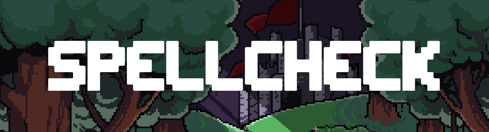

Spellcheck is a roguelike dungeon crawler adventure game I developed with a team of other students. My role was to create a system for levels to progress as you descend into the dungeon underneath a wizard school. You can check out the game <a href="https://charming-squirrel-cc2ef2.netlify.app/">here!</a>

In the game you use your spelling skills to cast spells and defeat the evil headmaster. (pun is intended)

Here is a trailer I made for the project. It is also available on the game's website.

<iframe width="640" height="360" src="https://charming-squirrel-cc2ef2.netlify.app/EXPLORE%20THE%20SCHOOL.mp4" frameborder="0"></iframe>
